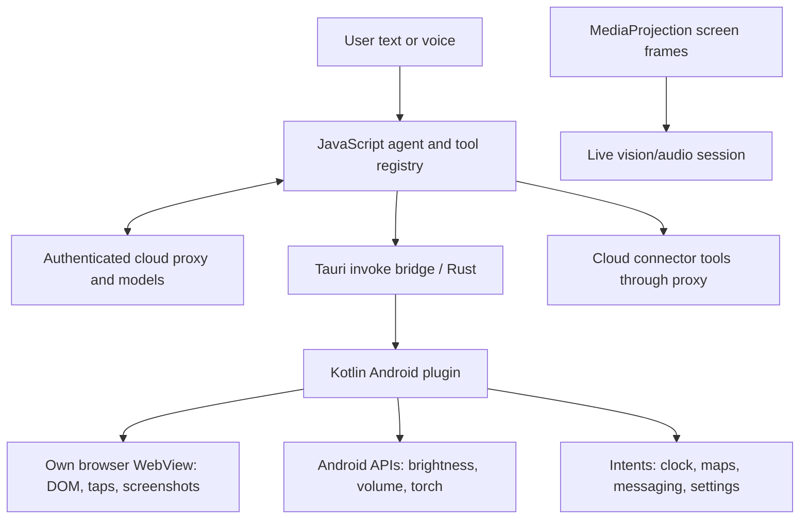

# ConscioussAI 1.0.2: unpacking and architecture findings

Static analysis of the supplied XAPK, performed 2026-09-19. This describes code shipped in this particular package, not a runtime certification of its advertised features. No app installation, account login, or requests to its backend were performed.

## Main finding

This is a Tauri application: HTML/CSS/JavaScript UI and agent orchestration, a compiled Rust native library, and Kotlin Android plugins. Much of the application-specific JavaScript ships as readable source with comments. For this package, **extracting assets first gives more useful information than starting with native reverse engineering**.

The inspected build does not declare an Android AccessibilityService. Its automatic taps and typing operate on its own browser WebView. Broader device features use Android APIs, intents, deep links, and cloud connectors. Screen sharing uses MediaProjection; observing another app's screen does not give this implementation the ability to tap that app.

## Package and generated files

- Package: `co.conscioussai.android`; version `1.0.2`, version code `15`.
- Minimum SDK 26; target and compile SDK 36.
- XAPK SHA-256: `11bf3a33bb1dc97f909851a8466cd3c612a21bb8dcaa8d46524462dd0dc553fe`.
- XAPK contains a base APK, ARM64 native split, English/French language splits, MDPI density split, icon, and package manifest.
- Base APK: 110,397,935 bytes. ARM64 split: 54,194,618 bytes.
- The ARM64 split contains `libconscioussai_android_v2_lib.so` (54,161,016 bytes). Tauri/Rust identifiers and bridge command names occur in this binary.

All large outputs and downloaded analysis tools are under the already Git-ignored directory [build/consciouss-analysis](../build/consciouss-analysis/). A build clean can remove these generated files.

| Location under that directory | Purpose |
| --- | --- |
| `xapk/` | Original extracted split APKs and XAPK manifest |
| `base/assets/assets/` | Readable frontend, agent, prompts, tools, and feature modules |
| `base/assets/index.html` | Web UI entry point |
| `arm64/lib/arm64-v8a/` | Compiled Rust/native library |
| `jadx/sources/` | Decompiled Java representation of Kotlin/Java DEX code |
| `jadx/resources/AndroidManifest.xml` | Readable Android manifest |
| `apktool/smali/`, `smali_classes2/`, `smali_classes3/` | DEX disassembly for methods JADX cannot reconstruct |
| `apktool/AndroidManifest.xml`, `apktool/res/` | Apktool's decoded manifest/resources |
| `bridge-commands.json` | Index of 129 distinct literal JavaScript invoke command names and their locations |
| `tool-declarations.json` | 112 name declarations found in the registry and Composio tool module; not a count of verified working features |
| `*-inventory.json` | Per-APK ZIP entry inventories |
| `jadx.log`, `apktool.log` | Decoder output and limitations |

There is also an `assets/src/assets/` tree. Begin with `base/assets/assets/`, which matches the paths loaded by the packaged HTML, rather than double-counting the source trees.

## How AI actions reach the device



The model produces structured actions. App code interprets those actions, checks results, executes supported commands, and feeds results back to the model. The model itself has no Android privileges.

### Browser automation

Evidence: [agent.js](../build/consciouss-analysis/base/assets/assets/agent/agent.js), [registry.js](../build/consciouss-analysis/base/assets/assets/tools/registry.js), and [BrowserPlugin.java](../build/consciouss-analysis/jadx/sources/co/conscioussai/android/plugin/BrowserPlugin.java).

- `AgentLoop` reads the page, calls `call_llm`, parses action JSON, and calls `executeAction` in a bounded loop. `maxStepsFor` sets 6/12/20 steps for quick/moderate/deep tasks.
- DOM actions include navigation, indexed clicks, text matching, text input, scrolling, and page reads. JavaScript prompts favor DOM controls before screenshot coordinates.
- Native `evaluate` calls `WebView.evaluateJavascript`. Native `tapAt` dispatches touch events directly to the content WebView. Those events are not injected across the Android desktop.
- `take-over.js` provides a separate screenshot-based computer-use loop through `proxy_anthropic_computer_use`, bounded to 10 turns / 90 seconds. Its model system instruction explicitly describes an Android in-app WebView.
- `webview-computer-use.js` also contains a simpler text-command router. The coexistence of both modules does not prove every live-session route uses the full computer-use loop.
- Shopping and booking helpers implement site-specific behavior. This is a mix of model reasoning and deliberately written automation, not a universal capability supplied by the model alone.

### Native device controls

Evidence: [SystemController.java](../build/consciouss-analysis/jadx/sources/co/conscioussai/android/plugin/SystemController.java), `BrowserPlugin.java`, and [android-system.js](../build/consciouss-analysis/base/assets/assets/tools/android-system.js).

| Feature | Implementation found | Practical boundary |
| --- | --- | --- |
| Brightness | `Settings.System`, with `canWrite` check and permission settings intent | Requires modify-system-settings access |
| Volume | `AudioManager` | Subject to stream and Android policy restrictions |
| Flashlight | Camera manager torch API | Hardware/permission dependent |
| Do Not Disturb | Notification policy APIs and access checks | Requires notification-policy access; runtime behavior needs testing |
| Alarms/timers | `SET_ALARM` / `SET_TIMER` intents with `SKIP_UI` | Delegates to installed clock app, similar to our executor |
| Wi-Fi | Direct API attempted below SDK 29; otherwise Wi-Fi settings | On newer devices the user toggles it |
| Bluetooth | Direct API attempted below SDK 31; otherwise Bluetooth settings | On newer devices the user toggles it |
| Airplane mode, mobile data, battery saver | Opens the corresponding settings screen | Manual action remains |
| WhatsApp, Telegram, SMS | URI / message-composer handoff | Opening a composer does not establish message delivery |
| Maps and rides | Maps URLs and Uber/Lyft deep links, with coordinate resolution helpers | Opening a prepared ride screen does not establish a booked ride |
| Contacts, calendar, location | Native bridge methods and requested permissions, plus cloud calendar routes | Depends on permissions and which route is selected |

A concrete reporting weakness: `_androidSystemControl` preserves `needs_manual`, but replaces the native explanation with `buildAndroidActionMessage`. Some replacements say Wi-Fi is enabled or a message was sent even when the native implementation only opened settings or a composer. Do not copy that success-reporting pattern.

### Screen sharing and voice

Evidence: [ScreenCaptureService.java](../build/consciouss-analysis/jadx/sources/co/conscioussai/android/plugin/ScreenCaptureService.java), [LiveAudioModeController.java](../build/consciouss-analysis/jadx/sources/co/conscioussai/android/plugin/LiveAudioModeController.java), and the `audio/` and `screen-share/` JavaScript modules.

- `broadcastStartPicker` requests Android's screen-capture consent flow.
- `ScreenCaptureService` creates a MediaProjection virtual display with an ImageReader and compresses captured frames to JPEG.
- Foreground services support screen capture and microphone/audio sessions; overlay code supplies the visual screen-sharing indicator.
- The native audio controller records 16 kHz audio and plays 24 kHz audio. It connects by WebSocket to the proxy's `/v1/hands-free/live` route and handles Gemini messages and tool responses.
- A bundled native constant names `gemini-2.5-flash-native-audio-preview-12-2025`. This is a shipped identifier, not verification of today's backend model.
- The manifest has no accessibility service, notification-listener service, or voice-interaction service declaration. In particular, this package is not evidence of the same default-assistant integration our project implements.

## Other capabilities represented in the package

These are implemented modules or tool declarations, not a promise that each works with a current account/backend.

| Area | Files to inspect under `base/assets/assets/` |
| --- | --- |
| Model selection and cloud routing | `chat/models.js`, `auth/auth.js`, `core/streaming-client.js` |
| Gmail/calendar and other connected apps | `connectors/`, `tools/composio-agent.js`, `tools/proxy-passthrough.js` |
| Web search and shopping | `shopping/web-search.js`, `shopping/browser-run.js`, `shopping/store-patterns.js` |
| Travel/booking flows | `travel/booking-flow.js`, `travel/booking-search.js` |
| Maps/ride preparation | `rides/ride-coords.js`, `rides/uber-deeplink.js` |
| Music/media handoffs | `tools/media-orchestrator.js` |
| PDF creation and document reading | `tools/create-pdf.js`, `lib/document-parser.js`; native PDF methods in BrowserPlugin |
| Office/document tools | `tools/brain.js`, `tools/registry.js`; some tools reference desktop/proxy flows |
| Memory, conversation/project storage and sync | `user/memory-store.js`, `user/conversations.js`, `user/projects.js`, `user/drive-sync.js` |
| Reminders and proactive follow-ups | `proactive/engine.js`, `proactive/store.js`, native notification/task classes |
| Live-session memory and ambient modules | `screen-share/live-memory-store.js`, `ambient/` |
| Authentication, plans, billing | `auth/`, `payments/`, Android billing classes |
| Remote feature gating | `core/feature-flags.js` |

The model catalog is fetched from the proxy and cached, with a bundled fallback. The agent contains proxy-routed Claude model identifiers; comments identify an OpenRouter route. Client code also references Google, Composio, and Gamma proxy operations. Actual server implementations, enabled models, credentials, entitlement rules, and integration behavior cannot be recovered or verified merely from the client.

## Recommended unpacking workflow

1. Preserve and hash the XAPK, then extract it as a ZIP. Keep all split APKs: the ARM64 split contains essential native code absent from the base.
2. Extract the base APK as a ZIP and inspect assets first. This recovered readable application JavaScript here without decompilation.
3. Use [JADX](https://github.com/skylot/jadx) for Java/Kotlin DEX browsing, cross-references, and decoded manifests. Its GUI is the most convenient next tool for exploring call sites.
4. Use [Apktool](https://apktool.org/docs/cli-parameters/) for smali and resource inspection when Java reconstruction fails. It complements JADX rather than replacing it.
5. Only investigate native disassembly if a specific Rust-side question remains. JADX cannot decompile the `.so`; [Ghidra](https://github.com/NationalSecurityAgency/ghidra) is a suitable next-stage native analysis tool. It was not needed or run for this initial architectural map.
6. Validate uncertain behavior on a dedicated compatible ARM64 test device/emulator with test accounts. This bundle contains only ARM64 native code. Install all its splits together, then test permissions, cancellation, network failure, and whether returned success means completion or handoff. Runtime testing was not part of this pass.

Downloaded locally: JADX 1.5.6 and Apktool 3.0.3 from their official GitHub release repositories. No system-wide tool installation was needed.

From the repository root, open the base APK interactively:

```powershell
.\build\consciouss-analysis\tools\jadx\bin\jadx-gui.bat .\build\consciouss-analysis\xapk\co.conscioussai.android.apk
```

Commands used for decoding (use fresh output directories when repeating):

```powershell
.\build\consciouss-analysis\tools\jadx\bin\jadx.bat -d build/consciouss-analysis/jadx -j 4 build/consciouss-analysis/xapk/co.conscioussai.android.apk
java -jar build/consciouss-analysis/tools/apktool.jar d -o build/consciouss-analysis/apktool build/consciouss-analysis/xapk/co.conscioussai.android.apk
```

JADX completed with **115 reported errors**. Some large methods contain decompiler placeholders; these are not exceptions intentionally thrown by the original app. Apktool generated smali and decoded outputs, but reported unresolved resource references while decoding the base split; its process returned nonzero. Treat resources as partial. Key native dispatch methods are present in `apktool/smali/co/conscioussai/android/plugin/BrowserPlugin.smali` and `SystemController.smali` for direct inspection. No rebuild was attempted or validated.

## Lessons for our Android assistant

Our existing `DeviceClockToolExecutor.kt` already uses the same basic alarm/timer mechanism. We can extend that design without adopting Tauri:

- Define explicit device tools implemented in Kotlin, with argument validation and permission-aware results.
- Distinguish `completed`, `opened_for_user`, `permission_required`, and `failed`. Require observed evidence before telling the user a message was delivered or a setting changed.
- Add a dedicated in-app browser if we want DOM-based shopping and web workflows. Keep its observation/action loop bounded and cancellable.
- Treat screen observation and cross-app control as separate features. MediaProjection provides observation. General interaction with other installed apps would need a separate design; this inspected app does not supply an AccessibilityService implementation to learn from.
- Keep connector actions separate from screen automation. An email sent through an authenticated API and an SMS composer opened by an intent need different completion semantics.

Framework references: [Tauri mobile plugins](https://v2.tauri.app/develop/plugins/develop-mobile/) explain the Rust/Kotlin bridge architecture. Android's [AccessibilityService reference](https://developer.android.com/reference/android/accessibilityservice/AccessibilityService) documents the service capabilities required for accessibility-based screen interaction; that service is absent from this manifest.

This analysis added documentation and generated local inspection artifacts. It made no changes to our application or backend implementation.
